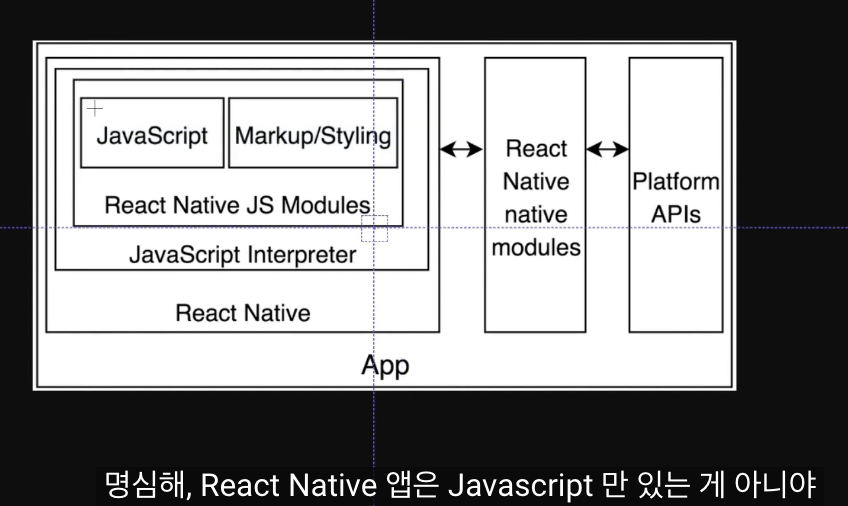
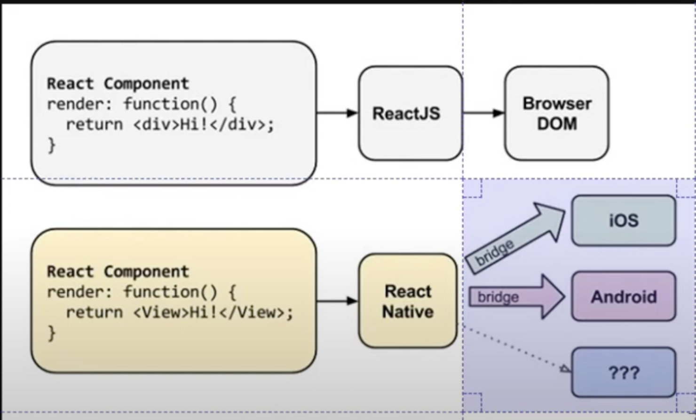
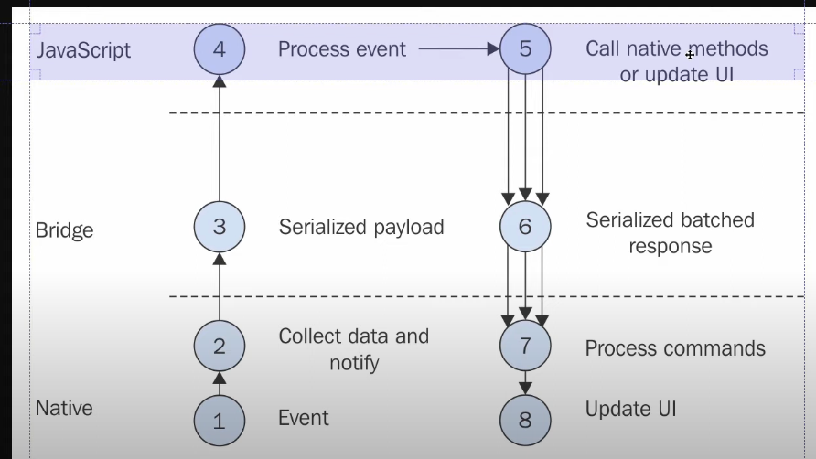
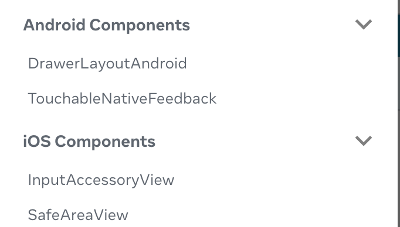
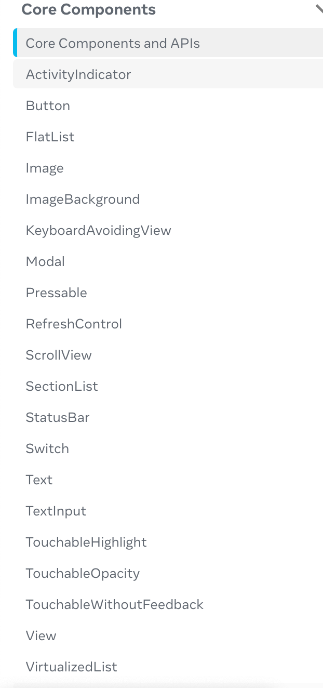
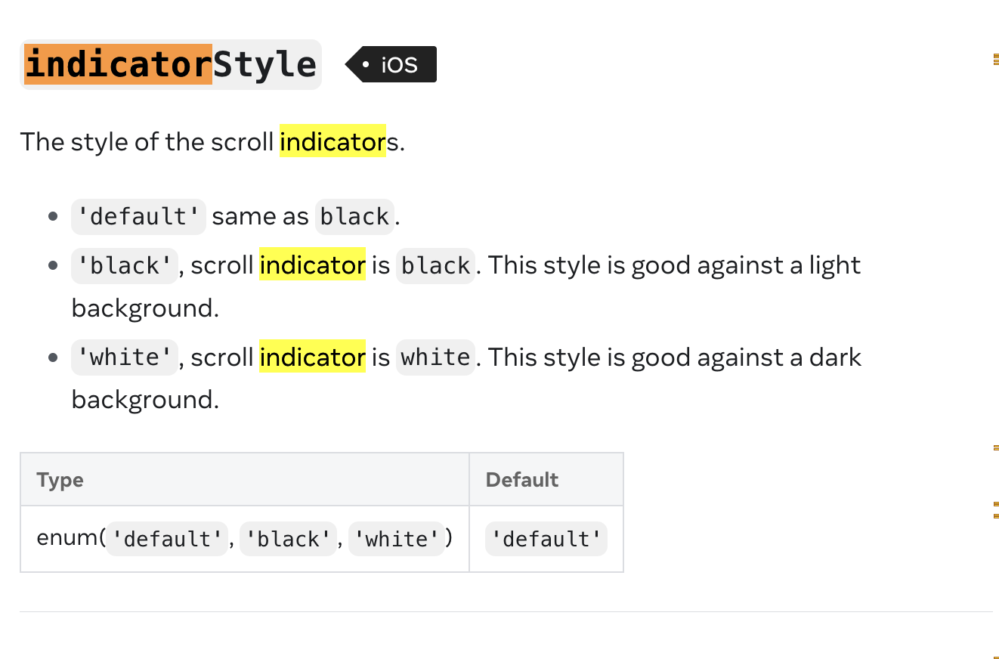

## 환경세팅 방법

#### 1. Expo를 활용하기

1.  Java, android studio 없이
    vscode, 핸드폰으로 앱 확인 가능.

설치 과정 스킵가능하게 하는 도구이용해서
폰으로 확인할 예정.

2.  테스트목적이고, 프로토타이핑을 위해 만들어지는것임.
    설치안하기위해 바로 폰에서 확인하기 위해 만든것.

직접 어플만들고싶거나 전문적으로 하고싶을땐,
Java, simulator, android studio 필요.

3.

Java와 Xcode가 인프라를 가져와서 apk와 ipa안에 넣어준다.
그 후에 app store에 보낸다.

누가 앱을 다운받으면 이런것들을 모두 다운받게 된다.

인프라 시설은 cpu아키텍처에 따라 다른 언어로 컴파일될것임

이런 환경을누군가 올려놨는데,
앱으로 올려눳는데,
Javasciprt, Markup/styling 부분만 배고. 다있는데,

그 앱에 코드를 전송하면됨.

그래서 컴파일할필요없고
이미 컴파일된 어플에, 코드만 전송할거다.

폰에서 테스트를 할 수 있다.
그건 Expo라고 함.

4.  리액트 네이티브에는 브라우저가 없다.
    그저 OS에게 ui를 만들어달라고 요청할뿐

native에서 이벤트에 대한 정보를 데이터로 모아서 브릿지에 보내면
브릿지에서는 json메시지로 만든다
자바스크립트코드는 이 시리얼라이즈드 된 이벤트 데이터를 받고
이벤트를 처리하고,

자바스크립트코드 내에서
네이티브 메소드를 실행하거나 ui를 업데이트 할때는
응답을 시리얼라이즈 하고
네이티브로 명령을 보내서 처리하여 ui를 업데이트.

이렇게 때문에 시뮬레이터가 잇어야함(JAVA Xcode 설치 필요)

#### 2. Native의 규칙과 날씨앱 만들기

1. 웹과 다른 컴포넌트 작성법

html로 변환되지 않기때문에 div는 활용할수없다.
View라는 컴포넌트를 활용한다.

text는 text component안에 들어가야한다.

2)웹과 다른 컴포넌트 작성법

브라우저의 경우 html마크업 써도 되지만 다른 환경ㅇ에선 에러남.

3. 웹과 다른 CSS특성

웹에서 가져올 수 없는 property들이 있다.
css 중 98퍼는 사용 가능.

StyleSheet.create는 object를 생성하는데 사용.

4. RN의 유지보수 용이성, 성능향상에 집중을 위한 선택 - 지원하는 기능 줄이기

https://reactnative.dev/
react native 문서임.

https://reactnative.dev/docs/components-and-apis
각 환경에 맞는 컴포넌트들에 대한 정보들도 확인할 수 있다.

StatusBar.
ReactNative가 제공하고, expo에서 제공하는 StatusBar가 각각 있는데 이들의 차이는 무엇일까?

RN 문서에는 과거에 더 많은 컴포넌트들이 있었는데,
(AsyncStorage같은 컴포넌트: RN을 위한 localStorage)
근데 지금은 사라졌다.
Navigation에 대한 것도 없다. 더이상 제공하지 않는다.
어떤 어플에 들어가더라도 Navigation이 있는데(다른 화면으로 이동가능한),

NacigatorIOS라는게 있었음. DatePicker

TabBarIOS, SnapShotViewIOS, ToolbarAndroid이런게 있었음.
지금은 없다.

API에도 AsyncStorage라는게 잇었는데 지금 업삳.
커뮤니티 패키지를 쓰라고 되어있다.
왜그럴까?

초기에 RN팀은 사람들에게 가능한 많은 Component를 제공하고 싶었다.

하지만, 이러한 방식이 버그를 일으키고, 모든 컴포너트를 지원하기 어렵다는 것을 깨달음
그래서 RN, Components, 그리고 APIs의 규모를 줄이고 가장 중요한 기능들만 남겼다.

왜냐면 RN을 성공시키려면 사용가능한 모든 Componetn를 만들기 보다는, 지원하는 범위를 줄이고
가능한 빠르게 만드는데에 집중하게 되었다.

5. 3rd party package

API는 자바스크립트 코드이다.
자바스크립트 코드가 운영체제와 소통하게 되는데,

react native의 문서에서 제공하는 qr코드를 스캔하면,
모바일디바이스의 Expo에 코드가 들어가면서, 실행이 가능하다.

API와 component의 차이
api는 javascript의 동작
component는 어떤게 렌더될지

4. 3rd party package - community package
   asyncstorage등의 문서에서 community package링크를 누르면 reactnative.directory에 들어가게되는데,
   https://reactnative.directory/?search=sms&order=downloads
   여기에는 3rd party package와 api들이
   있다.
   이는 community가 만든것들이다.

근데, 이전에는 옵션이 하나밖에 없었고 잘 작동했는데,
이제는 너무 많은 옵션이 존재
그래서 어떤 옵션을 사용할지 신중해야함.

expo는 React Native가 몇몇 package를 지원하지 않는다는 걸 안다. (옛날에 있던거)
하지만, 이런 pacakge가 매우 중요하다는것도 안다.

그래서 expo는 자체적을 package와 api를 만들기 시작햇고
이를 expo sdk라고 한다.

그래서 RN package 찾기 어려울때 expo packages를 쓰면 되긴함.
https://docs.expo.dev/develop/user-interface/store-data/

여기 문서를 보고 추천하는 라이브러리 중 정하면 될것같다.

https://docs.expo.dev/versions/latest/sdk/document-picker/
이건 expo sdk 문서이다.

여기엔 3rd party에 대한 내용과 함께
expo자체에서 관리하는 컴포넌트와 api에 대한것들이 들어있다.

StatusBar를 expo로도, react-native로도 사용할 수 있는 이유는
expo가 react native의 일부 component와 api를 복제하였기 때문이다.
(즉, 커뮤니티에서 자체적을 package를 만드려는 노력이 있기 때문이다.)
그래서 비슷하지만 다른부분도 있다.
예를들어 function 이름이 다르다.

Google Signin
LocalAuthentication(fingerprint)
등등 정말 많은 기능을 지원해주고 있다.

5. Layout System

- View 컴포넌트에서는 display flex라고 말할필요없음
  그냥 바로 flexDirection 설정 해주면 된다.
  이미 View가 flex container이기 때문이다.
  그리고 Web에서는 flexDirection초기값이 row엿지만,
  React native에서는 column이다.

- overflow가 일어난다고 해서 스크롤할수없다. 브라우저가 아니기 때문.

- 너비와 높이에 기반해서 레이아웃을 만들지 않을것이다.
  왜냐하면 너비와 높이값 등은 스크린 사이즈에 따라서 정말 다르게 보이므로
  반응형 디자인에대해 생각해야한다.
  수 많은 스크린에서 동일한 방식으로 보이는 레이아웃을 만드는 것에 대해 생각할 필요가 있다.

그래서 width height를 사용하지 않을거고
아이콘이나 아바타같은 경우는 사용할수있지만..
레이아웃의경우 스크린에 따라서 픽셀위주로 잡게되면 너무 달라보이기 때문이다.
그래서 react native방식의 레이아웃은!

flex size로 준다.

6. styles
   스크롤이 안되는걸 확인할 수 있다.

7. ScrollView
   horizontal

flex값이 먹히지 않는 상황 ->
contentcontainer style을 사용해야한다.
근데 이제 scroll이 잘 되지 않는다.
왜냐하면 ScrollView에는 Flex사이즈를 줄 필요가 없기 때문이다.
ScrollView는 스크롤보다 커야하기 때문이다.

화면너비 관련 api => Dimensions
OS마다의 네이티브한 특성으로부터 오는 값이므로 컴포넌트가 렌더되고 안되고의가 아닌, 네이티브의 정보로부터 가져오므로, 컴포넌트밖에서 사용이 가능한 것.

“React Native의 API”라고 할 때 보통 우리가 JS 코드에서 import 해서 쓰는 모듈(예: Alert, AsyncStorage, PermissionsAndroid 등)을 가리키는데, 이건 그림의 가운데 “React Native native modules”와 왼쪽 “React Native JS Modules” 영역에 해당합니다.

React Native에서 <View>, <Text> 같은 컴포넌트도 결국 “JS 모듈” 레이어에 속합니다.

React Native JS Modules
우리가 import 해서 쓰는 컴포넌트(View, Text, Button 등)와 스타일링 API(StyleSheet.create 등)는 모두 이 레이어에 있고,

내부적으로 네이티브 모듈(API)으로 브리지 넘어가서 실제 iOS/Android 뷰로 매핑됩니다.

React Native Native Modules
JS 컴포넌트가 호출하는 네이티브 쪽 구현체(예: UIManager, ViewManager)들이 여기에 있고,

이들이 다시 OS Platform APIs(UIKit, Android View 등)와 연결되어 있다.

보면 OS마다 호환이 되는 프로퍼티가 다르다.

8. Location
   expo-location
   geo location
   requestPermissionAsync()로 유저 권한 요청
   getLastKnownPositionAync() 로 현재 위치 얻기
   watchPositionAsync() 유저가 이동을 해도 따라가면서 위치 알 수 있음.
   reverseGeocodeAsync() 위도와 경도를 주면 도시와 구역 반환.

https://docs.expo.dev/guides/environment-variables/

9. open weather api

https://api.openweathermap.org/data/3.0/onecall?lat=${lat}&lon=${lon}&appid=${WEATHER_API_KEY}&units=metric

10. ActivityIndicator

11. expo icons
    @expo/vector-icons
